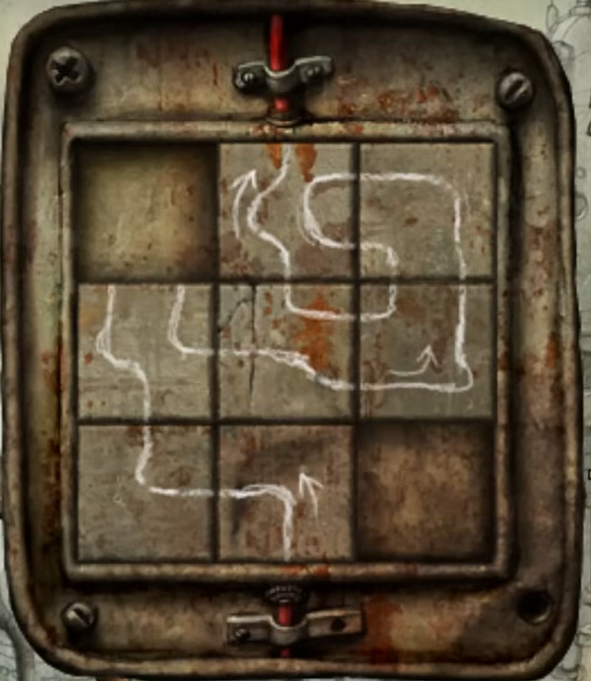

His instrument *seems* fine, but isn't working. Maybe there's something inside?

# Like what?
See for yourself! ^[Crouch down and have a look.]

# Hmm...
Whatever that creepy thing is, it's not moving. You'll need to flush it out with an equally fearsome creature, like a cat.

# Where will I find one?
In the area with the band, follow these steps: 
* Up the stairs in the background
* Continue up the stairs
* Up the stairs on your left, past the large clock

You'll find a cat here, sleeping on a roof.

# What do I do?
You can climb the ladder and try to grab the cat, but it'll quickly flee into the pipe on the right. Maybe you could approach it from another angle?

# Hmm...
The robot you so rudely climbed like a ladder earlier is working on the wires here. Could you make him move to the right?

# How do I do that?
Pulling on the wires would be a good way to make them too annoying to fix. You'll need to distract the electrician first, though. ^[What's he using to do his job?]

## Help me out.
Climb onto the robot's head to unplug his soldering tool. You can then pull on the long red wire while he's distracted, forcing him to move.

# Here, kitty kitty!
Still no luck, but the cat jumped down onto a railing while trying to escape. Could you take advantage of that?

# Hmm...
The railing is made of metal; if you got the electricity working, it would be quite a hazard for any passing cats.

# How do I get the electricity working?
Take a look inside the nearby lamp-post, and try not to groan. It's sliding puzzle time!

# Hey!
The piece in the top right was a bit loose, apparently. That might actually be helpful, though - keep your focus on the puzzle for now.

# What do I need to do?
Each block has a line on it - your job is to line them up, so the power flowing in at the bottom has a clear path to the wire at the top. The two missing tiles will end up in the bottom-right and top-left corners respectively.

# How does the sequence start?
The bottom-middle block has a '¬' shaped line and arrow on it, with the block on its left featuring an 'L' shaped line.

## Show me the solution.

# What about the missing tile?
It's time to deal with that damn bird! Your ladder-legged friend is too far away to be useful, though, and trying to grow bigger makes the bird do the same.

# What should I do?
The bird doesn't just copy your size - it copies your position. Could you take advantage of that? ^[Maybe you could make it dizzy?]

# Hmm...
The bird is more than happy to climb on top of the wire above the bridge. You might be able to snap it, with enough movement.

## Help me out.
Walk onto the bridge to make the bird climb onto the wire, then grow and shrink repeatedly. The bird will soon fall, and when it spits out the tile, you can use it to turn on the electricity.

# What now?
The lamp-post is brimming with electricity, but that doesn't mean the walkway is. Can you connect them without shocking yourself? ^[Didn't you just break the wire? Where is it?]

## Help me out.
Turn off the power by moving one of the tiles out of position, then click on the wire dangling nearby. Switch the power back on, and it'll be time to give the cat a wake-up call!

## What do I do?
When the cat is on the bridge, turn off the power by moving one of the tiles out of position. You can then send the cat into the digeridoo to [fix it.](clocktower)
