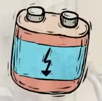

You've got the money, but where is it supposed to go?

# You tell me!
There's a machine selling batteries near the clocktower. Hand over your winnings from the arcade to get two batteries, but don't run off quite yet - something isn't right.

# What do you mean?
The guard's pet-son-toy needed a battery that looked like this. Yours don't look quite right.

# What should I do?
The drawing almost makes it look like two batteries tied together, doesn't it? ^[Look for something that can tie your batteries together.]

## Help me out.
Look at the ground where you helped the wheelchair-bound robot earlier; the bandage he left behind can be used to tie the batteries together, much to the [guard's delight.](fancyelevator)
