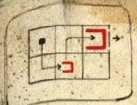

This one's a bit harder than space invaders! See [these hints](arcade) for help powering it up.

# What is the objective?
To get the small blue dot through the exit, which is usually unlocked when a red square is moved inside the larger red square. The dot can enter the shapes around it to move them, but cannot go through them or move them in a direction that would make the dot leave the square.

## Help me with the first puzzle.
Enter the small red square, move up, then move right. You can then go through the exit without leaving the squares.

# Can I get a clue for the second?
Start by moving the big red square above the small one, then moving the grey square down. You can reset the puzzle by clicking the button on the console.

## Help me with the second puzzle.
* Move the big red square to the space above the small one
* Move the grey square down into the bottom-right corner
* Move the big red square one space to the right
* Move the small red square into the grey square, then move them both up
* Put the small red square into the big red square and exit

# Can I get a clue for the third?
Start by moving down, right, and up. The big red square should stay in the top-right corner.

## Help me with the third puzzle.
* Start by moving down, right, and up twice.
* Move the small red square into the bottom-left corner
* Move the grey square on the top row into the left corner
* Move the small red square up one space
* Move the grey square on the bottom row into the middle
* Move the small red square up, right, down twice, right, then up into the big red square and exit

# Can I get a clue for the fourth?
Start by moving the big red square into the top-left corner and small red square into the bottom-right corner. You should then try to get the small grey square onto the top row.

## Help me with the fourth puzzle.
* Move the big red square into the top-left corner
* Move the small red square into the bottom-right corner
* Move the small grey square one space to the right, then move the big red square down
* Move the small grey square and small red square to the left by one space
* Move the small grey square into the big red square, then move it along into the bottom-right corner
* Move the big red square down, then put the small red square inside it and exit

# Can I get a clue for the fifth?
You'll need to move the grey square on the bottom row into the top-right corner. Start by moving the small red square into your starting position, then moving the big red square into the bottom-left corner. You should then move the big grey square on the top row above it.

## Help me with the fifth puzzle.
* Move the grey square on the top row into the top-right corner
* Move the small red square into your starting spot
* Move the big red square into the bottom-left corner
* Get back inside the small red square to access and move the grey square on the top row above the big red square
* Move the big red square one space to the right, then move the small red square one space to the left
* Get back inside the big grey square on the top row, and use it to get inside the big grey square on the bottom row.
* Move it into the top-right corner
* Move the big red square one space to the right, and small red square one space to the left
* Move the big grey square into the bottom-right corner
* Put the small red square into the big grey square in the corner, move left, then move down into the big red square and exit.

# Hooray!
Assuming that was the second game you beat, take the prize money and go [buy some batteries!](buybatteries)
