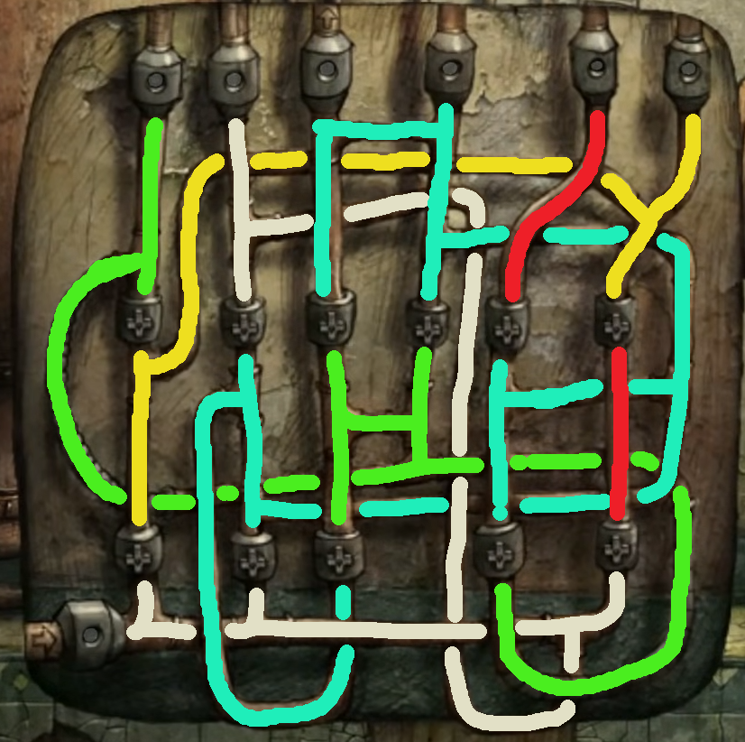
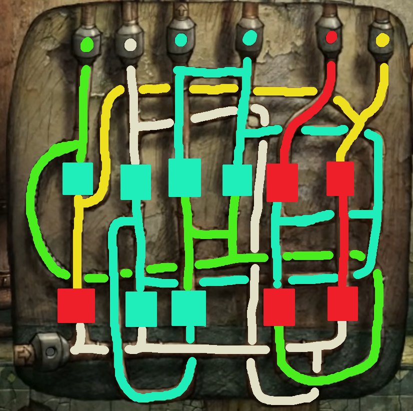
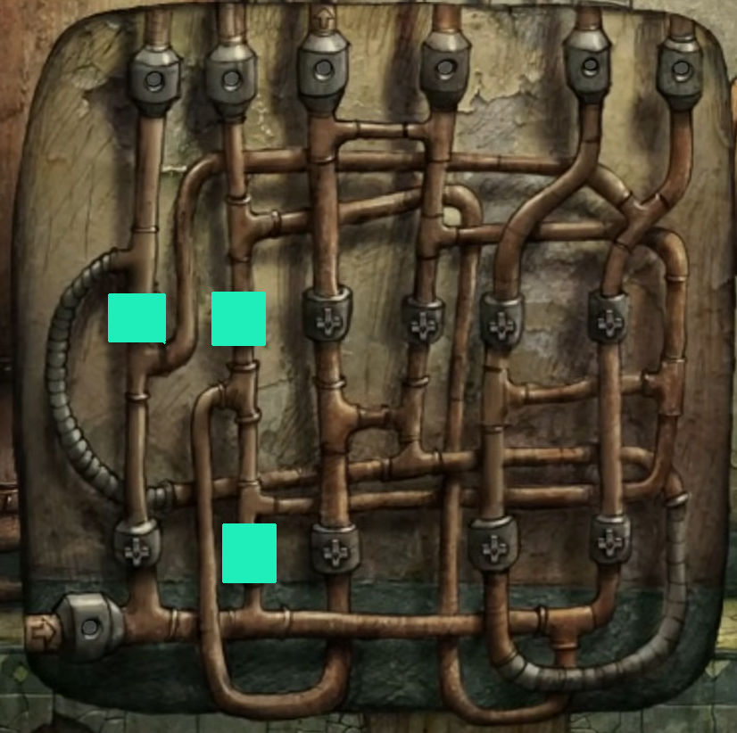

The big tank is empty, but you'll need to switch off the water if you want to progress.

# How do I do that?
There's a staggering number of pipes near the tank. You'll need to put three wrenches in very strategic spots to switch off the fountain, however.

# Where will I find the wrenches?
You got one for [emptying the tank](radio), and one is already holding a pipe shut. The other is somewhere in the room. ^[Where would you store something useful?]

## Help me find it.
Open the cabinet that you put the radio on, then search through the maintenance booklet. You'll find the third wrench on the last page.

# What now?
They're a mess to look at, but only one of these pipes is feeding water to the fountain - the third one along, with a small arrow on it. You'll need to use all three wrenches to cut off its flow, though.

# Help me get my head around this puzzle.
In the screenshot below, I've coloured-coded each pipe path - the blue path is the one you need to block.

# Another hint?
In this screenshot, I've shown five spots where you shouldn't place your wrenches (red) and six spots  where you could. Look closely at where each line stops and starts - can you cut off the green flow early?

## Show me the solution.
Put the wrenches in the three blue spots seen on the screenshot below.

# What now?
The fountain's been turned off - you can climb back up to the surface and [hop inside!](elevator)
