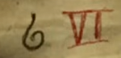

A brief chat with this strange-looking robot reveals that the bullies stole his music player.

# What should I do?
If you've already helped [the whole band](band), then you should have a radio. It's missing a speaker, though.

# Where will I find one?
Look no further than the area in front of the clocktower; you'll find one in the top right, next to the guard.

# Hmm...
It'll be hard to steal with the guard sitting there. Maybe you can encourage him to go home early?

# How do I do that?
Have a look at the scraps of paper near the clock - one shows a few symbols that seem to represent night-time. ^[You might not be able to control time, but you can control the clock. That's just as good.]

# Hmm...
The hole beneath the clock seems the perfect size for a crank. Look around this area for one. ^[You'll find one stuffed into a hole near the fountain.]

# What do I do?
Put the crank into the hole near the clock, then have another look at the 'night' symbols. ^[The clock needs to show one of the symbols depicted, as well as the IX numeral.]

# How do I do that?
Don't let the strange design confuse you!
* The outer circle represents hours with numerals
* The inner circle represents days with symbols
* A new day arrives when the hour passes 12
* Every clockwise crank increases the hour by 1
* Every counter-clockwise crank decreases the hour by 1

## Hmm...
No matter which 'night' symbol you choose, the guard doesn't move. Why not try changing the time to be one of the infinity symbols seen on the other note? ^[Try '~ VII']

# What now?
The guard's still on duty, but the other robot has left and revealed a new note. Hopefully this one is the guy's day off.

## What does the note show?

# What now?
The guard is gone! Quick, go and grab the speaker in his booth! With it, you can repair the radio and play some tunes for the wrench-headed robot.

## How do I do that?
Combine the speaker with the broken radio, then put it on the cabinet beneath him. Click on him afterwards for help with the [water tank.](pipes)
