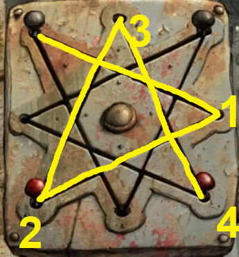
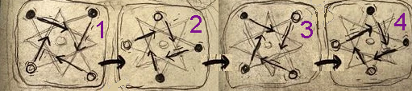

Filling it up and pulling the cord is a good start, but the console is the only thing that can get the elevator moving.

# How does it work?
It's not as bad as it looks - you just need to swap the pegs' positions, putting the red ones on top and black ones on the bottom.

# How do I do that?
The pegs can be moved along any line they're currently connected to. You'll need to move all four in sequence, however, as they'll quickly get in each others' way.

# Hmm...
Don't let the design confuse you; each peg can only move along two paths at a time. Pressing the button in the middle will reset the puzzle, too.

# Nudge me in the right direction.
From their starting points, each peg only needs to move four times before the puzzle is complete. Click the quickhint to see one peg's path.
^[
]

## Help me out.
The screenshot below shows the four moves that each peg must make - they often need to be moved out of each others' way, so don't worry if a move doesn't work immediately.

# What now?
When the red pegs are on top and black pegs are on the bottom, a lever will pop out. Pull it up and you'll be [on the move!](fan)
