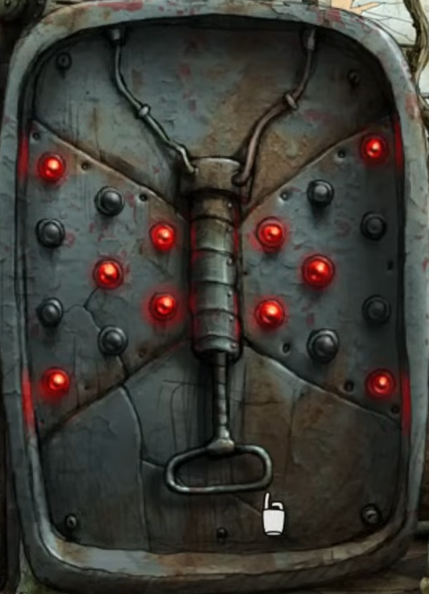

Have you seen the lock that's keeping you here? The design is quite unique.

# Strange!
Whoever owned this greenhouse clearly loved bugs and plants. Maybe they were researching them?

# How does that help me?
Look around the greenhouse for anything that looks like research - bonus points if it looks like it would fit inside the projector.

# Hmm...
In the desk on the right, you can find two slide decks - they look like drawers, and can be slotted into the back of the projector.

# Slight problem...
No matter which slide deck you use, nothing will happen. Take a closer look at the projector - doesn't it look like something should be in front of the beam of light?

# What am I looking for?
You're locked in, so whatever you need must be somewhere in this room. ^[It looks like one of the flytraps has swallowed something big.]

# Hmm...
The plant-growing beam can be pushed around, and might make the flytrap open up. ^[You can activate it via the panel you found the grid puzzles on.]

# What now?
The flytrap is open, but apparently still hungry. You'll need to find something that can hold it open while you feel around inside.

## Help me out.
Grab the stick that's holding up the plant, then use it on the flytrap.

# What now?
The magnifying glass can be used on the projector to get it working, and the remote can be used to look through the slides.

# What am I looking for?
The greenhouse was locked with a strange butterfly mechanism.  Do either of the slide decks have a focus on insects and bugs?

## Help me out.
Put slide deck 1 into the projector, then use the remote to look through its slides. One shows a butterfly with some spots you should copy into the lock.

## Show me the solution.
When the dots seen below are all lit up, you can pull the lever to [open the door.](battery)

