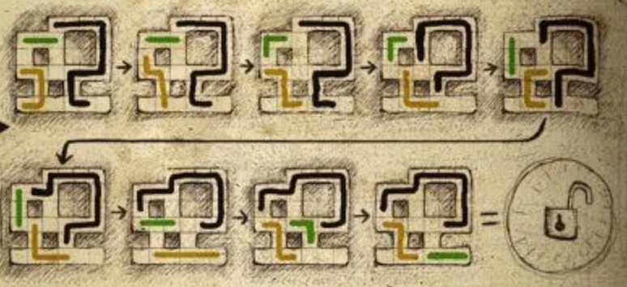
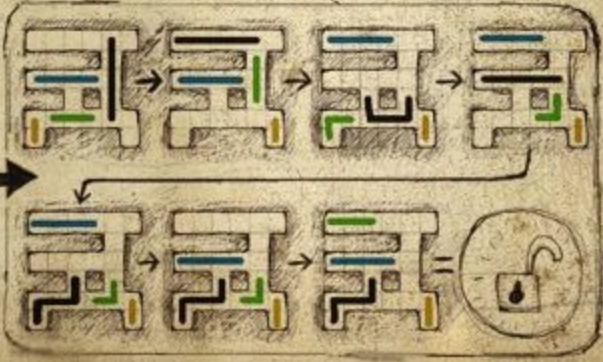

On the left side of this strange dome-room, you'll find a pair of the game's most aggravating puzzles. **Make a manual save before attempting either of them!**

# What do I need to do?
Move the green beads into the green area by moving the other beads out of their way. The two mazes have no effect on each other.

# Any tips?
Pay close attention to the number of beads you're moving; space is limited, to but it's impossible to get stuck, even if it feels like you've run out of moves.

## Give me the solutions.
Load your manual save to return the beads to their starting points, then follow the diagrams below. 

Top maze:

Bottom maze:

# What now?
If you tried to speak to the huge-headed robot earlier, you know why he's upset - one of the bullies connected to his brain with a cable. You can use the cable you just got to connect *your* brains and try to [repair the damage.](brainmaze)
