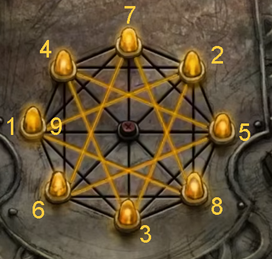

You've got the lamps. Now you just need to get down to the basement.

# What is the symbol?
A very fancy star! Unlike the other drawing, though, the one you draw does need to be accurate.

# Any tips?
It's not as difficult as it looks - you basically just need to draw a few triangles, so will be making several diagonal connections.

## Help me out.

# What now?
A huge hammer, and a tiny key behind some glass. Interesting. ^[Smash the glass with the hammer.]

# Smash and grab!
Key acquired! It doesn't work with the padlock, though, and you'll need to get it open to flush away the bullies for good. Have you found any other locks the key might work with?

# Hmm...
You don't need to go back up to the other floors, but might have luck in the elevator regardless. ^[Use the key on the locked panel in the elevator.]

# What now?
Freeze-spray? Whatever you spray will become quite easy to smash.

## Help me out.
Use the freeze-spray on the padlock, then [smash it with the hammer.](dome)
