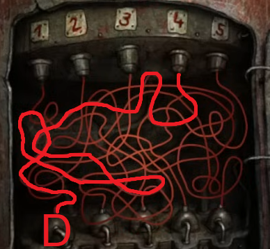

4 minutes and 30 seconds on the clock! Good luck!

# What do I do?!
Stay calm - this is just like the pipe puzzle. You need to follow each wire from top to bottom to see which letter it matches.

# How do I know which letter it matches?
The bomb tells you:
* 1 = A
* 2 = B
* 3 = C
* 4 = D
* 5 = E

# Nudge me in the right direction.
See the quick hints below for help with 2 of the 5 wires.
^[] ^[]

## Give me the solution.
Put the fuses in this order:
* D
* B 
* E
* A
* C

# Hooray!
You've saved the day, but the game isn't over yet. Head up the stairs in the trophy room [to continue.](beads)
