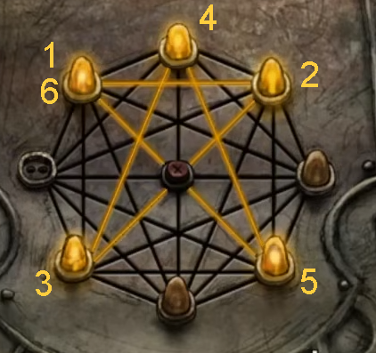

Thankfully, this elevator doesn't need any fuel - but its control panel does seem to be missing a few bulbs.

# What should I do?
If the elevator is fancy enough to have a carpet, then it's probably fancy enough to have a cleaning robot.

# How does that help me?
If you made a mess, you could see if the cleaning robot has found the missing bulbs.

# How do I make a mess?
Click on the bottom of the plant to scatter some dirt.

# Hmm...
The cleaning robot doesn't seem to be very social. You might have to get a bit hands-on.

## Help me out.
Scatter some more dirt, then click on the robot as quickly as you can while it's scooping it up. You'll get a bulb that can be placed on the panel.

# What now?
You're currently on floor 1, and the bullies' bomb seemed to be on the top of the penthouse. Where could the code for floor 2 be? ^[-1 is at the bottom, so 2 should be at the top.]

## Help me out.
Stretch up to move the leaf out of the way, and you'll see the sequence that will get you onto floor 2.

# What is the symbol?
A star! The one you draw with the panel doesn't have to match the drawing exactly, though. See the quick hint for help drawing it. ^[]
